# Perseverance

## Overview

**Perseverance** is an autonomous wall-following robot developed for the **Embedded Systems** course at Cairo University.

The robot navigates a predefined maze using three ultrasonic sensors and a finite state machine (FSM). The entire system is implemented in embedded C using PlatformIO, emphasizing modular software architecture, hardware abstraction, and real-time control.

---

  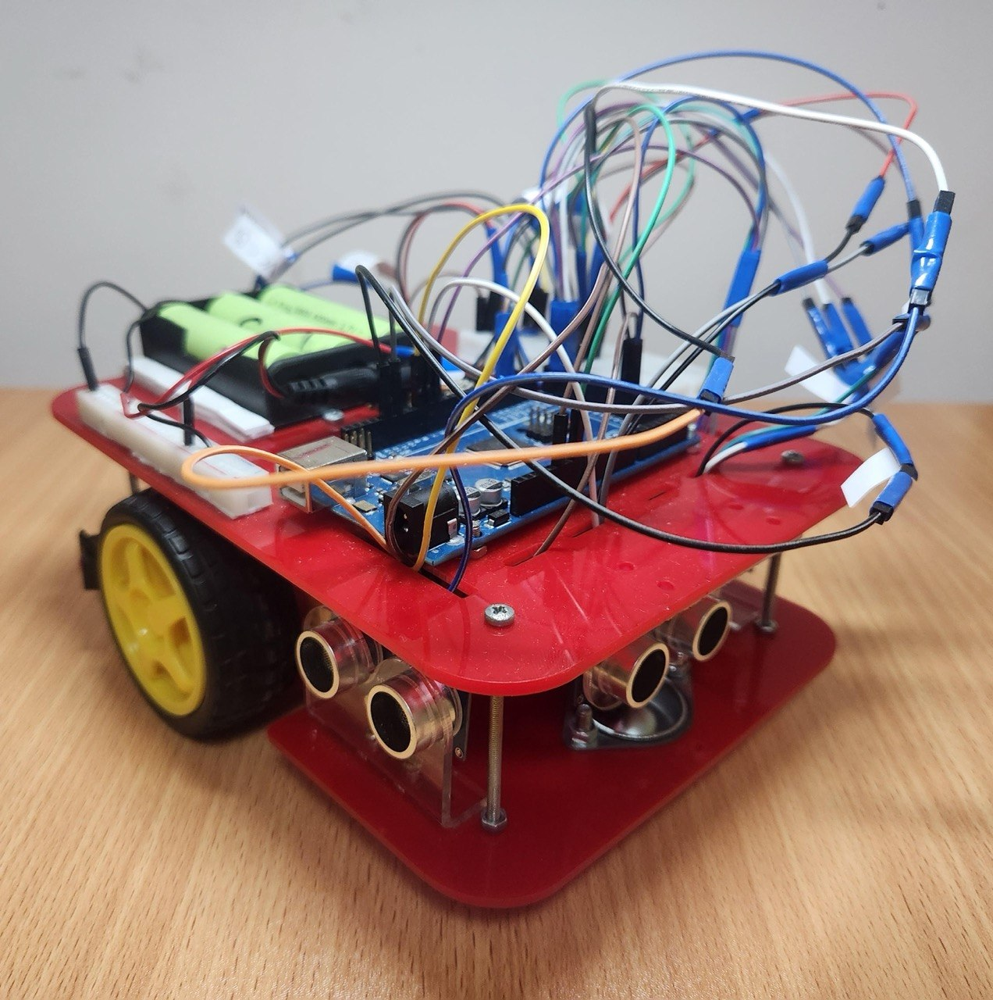

---

## Demo

**[Watch the robot navigate the track](media/track_run.mp4)**

---

## 🔧 Mechanical Design

### 1. Car Dimensions

| Label | Dimension | Value |
|-------|-----------|-------|
| A | Length | 19.8 cm |
| B | Width (with wheels) | 16.1 cm |
| C | Width (without wheels) | 14.8 cm |
| D | Height (with wheels) | 7.1 cm |
| E | Height (without wheels) | 5.4 cm |
| F | Height off the ground | 1.7 cm |

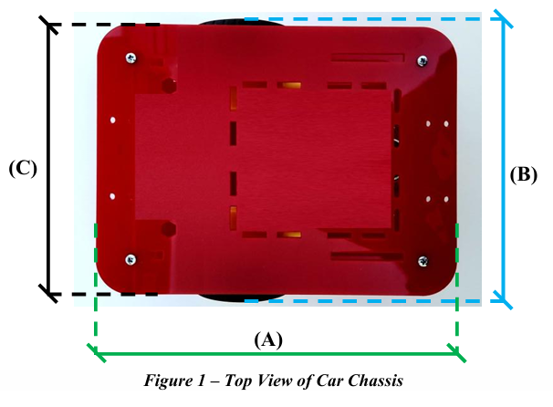

  

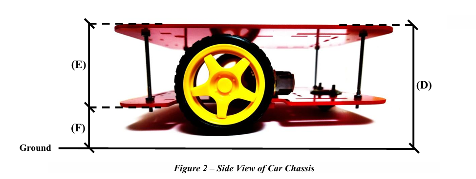

> **Note:** These photos are of the car chassis as built by the team, not a pre-bought kit.

### 2. Chassis Structure, Wheel Placement & Sensor Layout

- The car uses a **rectangular chassis made of acrylic**.
- The structure holds the motors, batteries, controller, and sensors.
- The car uses **two driven wheels** on the left and right sides that allow **differential drive**, with **one caster wheel** placed at the back for balance.
- **Differential Driving:** By changing the speed of each wheel, the car can move forward, turn left, turn right, or rotate in place.
- The caster wheel supports stability without affecting steering.
- The car has **three ultrasonic sensors** (Front, Left Side, Right Side).

---

## Electrical Design

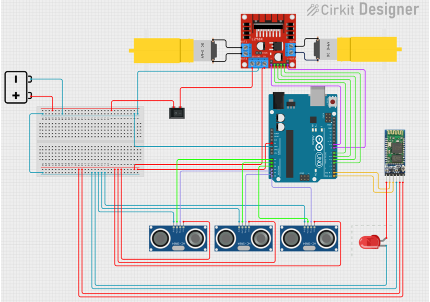

---

## Communication Plan

**Bluetooth** is selected as the communication method between the car and the PC, since the project only requires short-range communication.

**Benefits of using Bluetooth:**

- **Low power consumption** (helps save battery power)
- **Simple to implement & easy to configure** compared with Wi-Fi, hence **lower system complexity**
- **Suitable for short-range communication**
- **No need for Wi-Fi range**, since the car does not need communication over more than 10 meters

---

## FSM Design

### State Table

| L | F | R | State(s) | Description |
|---|---|---|----------|-------------|
| 0 | 0 | 0 | Finished | Car has escaped the path |
| 0 | 0 | 1 | Possible left corner / Post left corner | Just before/after turning left |
| 0 | 1 | 0 | N/A | N/A |
| 0 | 1 | 1 | Turning left | The car is actively turning left |
| 1 | 0 | 0 | Possible right corner / Post right corner | Just before/after turning right |
| 1 | 0 | 1 | Moving forward / Right align / Left align | The car is moving forward and aligning itself |
| 1 | 1 | 0 | Turning right | The car is actively turning right |
| 1 | 1 | 1 | N/A | N/A |

### Inputs

| Input | Description |
|-------|-------------|
| `001` | Right sensor detected wall — right reading < threshold |
| `010` | Front sensor detected wall — front reading < threshold |
| `100` | Left sensor detected wall — left reading < threshold |
| `isRA` | Car is aligned from the left — `left reading - right reading < threshold` |
| `isLA` | Car is aligned from the right — `right reading - left reading < threshold` |

### Outputs

| Output | Description |
|--------|-------------|
| `F` | Move forward |
| `TR` | Turn the car right |
| `RA` | Tilt right slightly |
| `TL` | Turn the car left |
| `LA` | Tilt left slightly |
| `S` | Stop |

---

## FSM Diagram

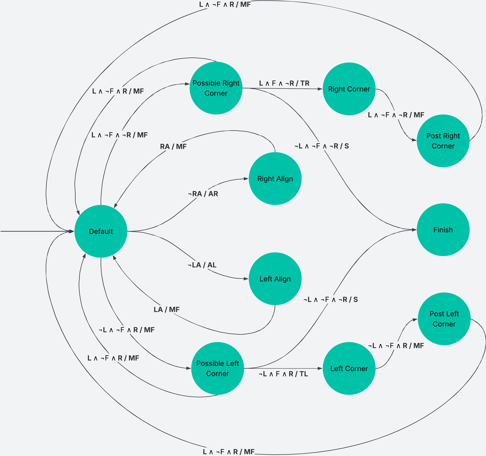

---

## Algorithm Description

### `101` — Default (Move Forward)

- **Current sensor readings:** `101`
- **Movement:** Forward
- Four inputs could move it to another state:
  - Possible right corner: `100` → action `F`
  - Possible left corner: `001` → action `F`
  - Right align: `Not isRA` → action `RA`
  - Left align: `Not isLA` → action `LA`

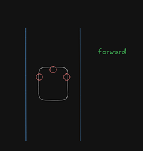

### `100` — Possible Right Corner (Move Forward)

- **Current sensor readings:** `100`
- **Movement:** Forward
- Three inputs could move it to another state:
  - Default: `101` → action `F`
  - Right corner: `110` → action `TR`
  - Finish: `000` → action `S`

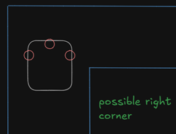

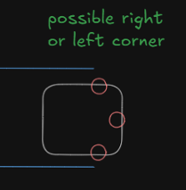

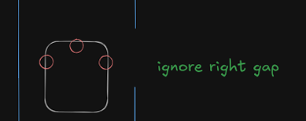

### `110` — Right Corner (Turn Right)

- **Current sensor readings:** `110`
- **Movement:** Turn Right
- One input could move it to another state:
  - Post right corner: `100` → action `F`

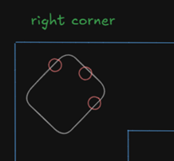

### `100` — Post Right Corner (Move Forward)

- **Current sensor readings:** `100`
- **Movement:** Forward
- One input could move it to another state:
  - Default: `101` → action `F`

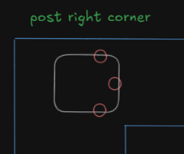

### `000` — Finish

- **Current sensor readings:** `000`
- **Movement:** Stop

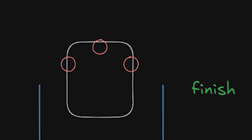

### `101` — Right Align (Tilt Right Slightly)

- **Current sensor readings:** `101`, `dr - dl > threshold` (`Not isRA`)
- **Movement:** Tilt Right Slightly
- One input could move it to another state: `isRA`
  - Default: `101`

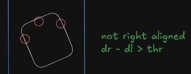

> **Note:** The same algorithm applies symmetrically for the left side (possible left corner → left corner → post left corner, and left align).

---

## Build, Upload & Monitor (PlatformIO)

This project uses **PlatformIO**. If you're using the PlatformIO extension in VS Code, the following shortcuts map to these CLI commands:

| Action | Shortcut | Equivalent CLI Command |
|--------|----------|-------------------------|
| Compile | `Ctrl + Alt + B` | `pio run` |
| Upload to board | `Ctrl + Alt + U` | `pio run -t upload` |
| Open Serial Monitor | `Ctrl + Alt + M` | `pio device monitor` |

---

## Author

**Ahmed Mohamed**  
📧 [ahmed.mohamed04@hotmail.com](mailto:ahmed.mohamed04@hotmail.com)  
🔗 [LinkedIn Profile](https://www.linkedin.com/in/ahmed04/)
